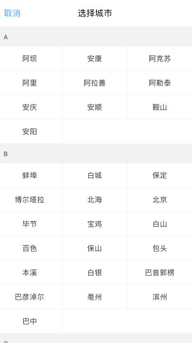

# react-native-city-select
[](https://github.com/ryanyu104/react-native-city-select/blob/master/LICENSE.md)
[](https://www.npmjs.com/package/react-native-city-select)



## Table of contents
- [Install](#install)
- [Usage](#usage)
- [Notice](#notice)
- [Options](#options)
- [Response object](#the-response-object)

## Install

`npm install react-native-city-select@latest --save`

## Usage

```javascript

import CitySelect from "react-native-city-select"

const CITY = {
  A: [
    {
      cityId: '279',
      cityName: '阿坝',
      cityNameEn: 'Aba',
    },
    {
      cityId: '329',
      cityName: '安康',
      cityNameEn: 'Ankang',
    },
  ],
}

class Example extends Component {
  constructor(props) {
    super(props)

    this.state = {
      cityStatus: false,
      cityText: '',
      cityId: '',
    }
  }

  handleCityPress=()=> {
    this.setState({
      cityStatus: true,
    })
  }

  handleCitySelect=(cityObj)=> {
    this.setState({
      cityStatus: false,
      cityText: cityObj.cityName,
      cityId: cityObj.cityId,
    })
  }

  handleCityCancel=()=> {
    this.setState({
      cityStatus: false,
    })
  }

  renderCitySelect() {
    if (this.state.cityStatus) {
      return (
        <CitySelect
          cancelCity={this.handleCityCancel}
          selectCity={this.handleCitySelect}
          cityData={CITY}
          selectedId={this.state.cityId}
        />
      )
    }
  }

  render() {
    return (
      <View>
        <TouchableOpacity
          onPress={this.handleCityPress}
        >
          <Text>
            click me!
          </Text>
        </TouchableOpacity>
        {this.renderCitySelect()}
      </View>
    )
  }

}

```

### Notice

<b>Position:</b> Put the CitySelect component at the bottom of the container, to avoid hierarchical relation problem.

<b>City data:</b> Get the data of Chinese cities, [click here](https://github.com/ryanyu104/react-native-city-select/blob/master/cityData.js)


```javascript

  const CITY = {
    A: [
      {
        cityId: '279',
        cityName: '阿坝',
        cityNameEn: 'Aba',
      },
      {
        cityId: '329',
        cityName: '安康',
        cityNameEn: 'Ankang',
      },
      ...
    ],
    ...
  }

```


### Options

Key | Type | Defalut
------ | ---- |  ----
cancelCity | function | null
cancelColor | string | '#51a8fb'
cancelSize | number | 14
selectedBg | string | '#26A1FD'
selectedId | string | ''
selectCity | function | null
cityData | object | null
cancelText | string | '取消'
titleText | string | '选择城市'
hasHeader | boolean | true


### The Response Object

key | Type
------  | ----------------------
cityObj | Object

